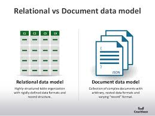

*************
Back End
*************

**What is Data ?**
	- In simple words data can be facts related to any object in consideration.
	- For example your name, age, height, weight, etc are some data related to you. 
	- A picture , image , file , pdf etc can also be considered data. 

**What is a Database ?**
	- Database is a systematic collection of data. Databases support storage and  manipulation of data. Databases make data management easy. Let's discuss few examples. 
	- An online telephone directory would definitely use database to store data pertaining to people, phone numbers, other contact details, etc. 
	- Your electricity service provider is obviously using a database to manage billing , client related issues, to handle fault data, etc. 
	- Let's also consider the face book. It needs to store, manipulate and present data related to members, their friends, member activities, messages, advertisements and lot more. 
	- We can provide countless number of examples for usage of databases. 

**What is a Database Management System (DBMS) ?**
	- Database Management System (DBMS) is a collection of programs which enables its users to access database, manipulate data, reporting / representation of  data . 
	- It also helps to control access to the  database. 
	- Database Management Systems are not a new concept and as such had been first implemented in 1960s.
	- Charles Bach men's Integrated Data Store (IDS) is said to be the first DBMS in history. 
	- With time database technologies evolved a lot while usage and expected functionalities of databases have been increased immensely. 

**So what is DBMS ?**
	- Database -------->  Management --------> System.
	- Database – A respective Database to Store Data.
	- Management -------> CRUD operations 
		a) Create
		b) Replace 
		c) Update
		d) Delete
	- System -------> A software to do basic things and carry out different operations.
	- So basically with the help of software a required engineer can carry out different functionalities.
	- So helping you to carry out different operations on database.
	- System plays a major role.
	- There are different DBMS software available in market.
	- Before that lets look in for some more details.

	- Architecture of Database:

	- It defines how you will store data in database and how different functionalities can work.
		- Different Types of Architecture of Database.
			1. One Tier Architecture.
			2. Two Tier Architecture.
			3. Three Three Architecture.
	- 1 tier architecture:
		a) All in one computer.
		b) Application.
		c) Database and software.
		d) Presentation.
		e) All in one computer. E.g Ms Office
	- 2 tier architecture.
		a) client
		b) server 
	- 3 tier architecture 
		a) Mostly used for web applications.
		b) In this architecture – client side ...application side and database.E.g Face book Login.

	- Now in 2 tier application is all on one computer and database on another.
	- So in 2 tier architecture. One computer will have application and other will have database.
	- Advantage is – speed.Clients are Direct communication. E.g. College,LAN etc
	- But in case of 3 tier – GUI one case ...application on some other computer [Which will have logic and manipulation of data facilities]--- And now database i.e database server and thats how things work.
	- So external level/ view level ------ Conceptual and logic level -----Database level.

	- Following are images of 1 - tier 2 -tier and 3 tier architecture.
		.. image::  _static/1tier.png
		
		.. image::  _static/2tier.png
		
		.. image::  _static/3tier.png

	- Now how to maintain DBMS ?
		1. Manually.
		2. Electronically.

	- Manually – paper and file based system manually.
	- Electronically – Meaning 
	    • Computer
	    • Digital Diaries
	    • Mobile Phone

	In computer -- 
	DBMS.
	Flat file system.
	Office Automation.

	- What is File Based System.
	- Storing lots of content in files.
	- But some  problems:
	    1. Data redundancy(Renaming and more)
	    2. Inconsistent data(Updating data everywhere)
	    3. Data separation and isolation(As many things will be there at one place)
	    4. Limited Data Sharing.
	    5. Security problems and Backup Recovery problem.

	- Why DBMS BETTER THAN FILE SYSTEM ?

	- Advantages of using DBMS over File System.
	    1. Controlling Data Redundancy.
	    2. Data Abstraction. [eg. Showing data of individual much easily.]
	    3. controls data inconsistency – As one change can update everywhere. Plus duplicate files also removed.
	    4. Data  Manipulation easily.
	    5. DBMS  easy sharing and Security.
	    6. Support multiple users.
	    7. Backup Recovery also good.

	- Database Schema.

	- Overall design of database is called – Database schema

	- So if you want to know anything about database – You can ask for database schema.

	- 3 levels of database schema.
	    1. View Schema.
	    2. Logical Schema.
	    3. Physical Schema.
			
	- E.g Simple database – mysql – you can see the table, Logical play with table and database. Physical Schema --- Stored in form of hexamdecimal and binary data. Etc.

	- View Schema – user will work.
	- Logical Schema – Programmer will work. [Table format]
	- Physical Schema – In database --- These tables will be stored in bytes and bits.

	- Database Models

	- Database models show the logical structure of database and logical structure of database.
	    1. Hierarchical Database model
	    2. Object Oriented Model
	    3. Network model 
	    4. Relational database model
	    5. Document Oriented model
	    6. star schema etc ...but top 4 are useful.
       

	- Entity relationship Diagram model.

	- E-R Diagrams are visual representation of data in database and also helps in showing relationship of sets stored in database.

	- There are 4 major types of DBMS. Let's look into them in detail.
	    • Hierarchical - this type of DBMS employs the "parent-child" relationship of storing data. This type of DBMS is rarely used nowadays. Its structure is like a tree with nodes representing records and branches representing fields. The windows registry used in Windows XP is an example of a hierarchical database. Configuration settings are stored as tree structures with nodes. 
	    • Network DBMS - this type of DBMS supports many-to many relations. This usually results in complex database structures.  RDM Server is an example of a database management system that implements the network model. 
	    • Relational DBMS - this type of DBMS defines database relationships in form of tables, also known as relations. Unlike network DBMS, RDBMS does not support many to many relationships.Relational DBMS usually have pre-defined data types that they can support. This is the most popular DBMS type in the market. Examples of relational database management systems include MySQL, Oracle, and Microsoft SQL Server database. 
	    • Object Oriented Relation DBMS - this type supports storage of new data types. The data to be stored is in form of objects. The objects to be stored in the database have attributes (i.e. gender, ager) and methods that define what to do with the data. PostgreSQL is an example of an object oriented relational DBMS. 

**What is SQL ?**
	- Structured Query language (SQL) pronounced as "S-Q-L" or sometimes as "See-Quel"is actually the standard language for dealing with Relational Databases. 
	- SQL programming can be effectively used to insert, search, update, delete database records. 
	- That doesn't mean SQL cannot do things beyond that.
	- In fact it can do lot of things including, but not limited to, optimizing and maintenance of databases. 
	- Relational databases like MySQL Database, Oracle, Ms SQL server, Sybase, etc uses SQL ! How to use SQL syntaxes? 
	- SQL syntaxes used in these databases are almost similar, except the fact that some are using few different syntaxes and even proprietary SQL syntaxes. 
	- SQL Example 
	 	SELECT * FROM Members WHERE Age > 30 

**What is NoSQL ?**
	- NoSQL is an upcoming category of Database Management Systems. Its main characteristic is its non-adherence to Relational Database Concepts. NOSQL means "Not only SQL".  
	- Concept of NoSQL databases grew with INTERNET giants such as Google, Face book, Amazon etc who deal with gigantic volumes of data. 
	- When you use relational database for massive volumes of data , the system starts getting slow in terms of response time.
	- To overcome this , we could of course "scale up" our systems by upgrading our existing hardware. 
	- The alternative to the above problem would be to distribute our database load on multiple hosts as the load increases. 
	- This is known as "scaling out". 
	- NOSQL database are non-relational databases that scale out better than relational databases and are designed with web applications in mind. 
	- They do not use SQL to query the data and do not follow strict schema like relational models.With NoSQL, ACID (Atomicity, Consistency, Isolation, Durability) features are not guaranteed always 

	- So basically NOSQL database came into picture only for 2 things
		1. High speed for data retrieving. 
		2. Flexibility and storage of data.

	- There are many more things but these are two major.

	- Major problem with RDBMS is scalability.
	- What is scalability -- Scalability is the capability of a system, network, or process to handle a growing amount of work, or its potential to be enlarged to accommodate that growth.

**NOSQL** 
	1. Document database management system.
	2. Key value database. E.g Re disc.
	3. Wide column database – Cassandra.
	4. Graph and node based database system -- Neo4j
		e.g Face book
	5. Now main question --- When to use RDBMS and NOSQL
		    • small scale – RDBMS
		    • But company , start up , scalability etc – NOSQL
		    • But there are many advantages and disadvantages 
		      

**What is Big Data ?**
    • A term for data sets that are so large that traditional methods of storage and processing are inadequate.
    • Massive increase in data volume within the last decade or so.
    • Social network and search engines etc.
	No Sql handles data more easily and nice.
	No Sql handles unstructured data.
	Cheaper to manage.
	Scaling and many things are necessary.

**What is Structured and Non – Structured data ?**
	- Structured: data stored in relational database, can be shown as two-dimensional table with rows and columns.
	- Unstructured: voice, video, text, photo, time series, nested data, etc. which is impossible or very hard to be filled in two-dimensional tables.

	Types of NoSQL databases
	    • Document database – Mongodb CouchDB
	    • Column Database – Apache Cassandra
	    • Key value – Redis
	    • Cache system – Redis
	    • Graph Database -- Neo4j

